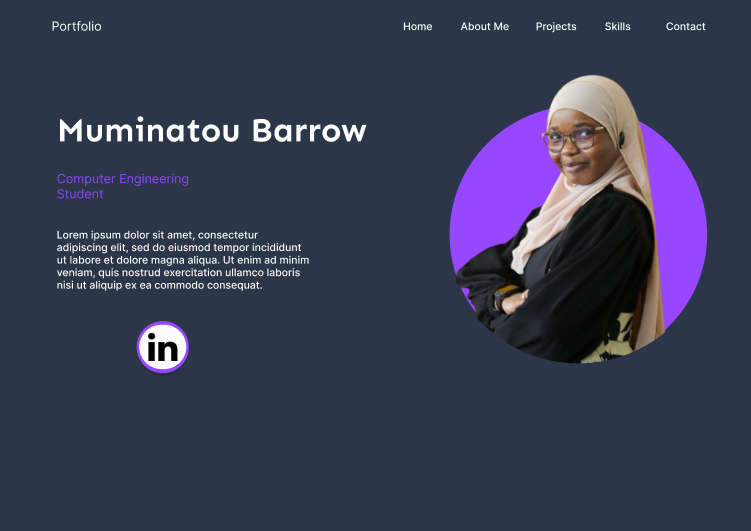

In the README.md file, write briefly on the following topics:

Project Overview:
Provide a brief description of the project, its purpose, and goals. Explain what problem the project aims to solve or what value it brings to users.

Project>>> Personal Portfolio Website: 
Design and implement a visually appealing and user-friendly website layout.
Include sections for an “about me”, skills, projects, and contact information.
Display projects with brief descriptions, images, and links to live demos or source code repositories.

Overview>>> As a web developer, it is very important to have a portfolio where
your most important projects could be displayed. This portfolio also would have a 
brief description of yourself for viewers to know who you are.
It should also have links to your professional social media pages for anyone 
wanting to view and know about your social media presence.

>>>Required Tasks:

--Design and implement a visually appealing and user-friendly website layout using HTML and CSS.
--Include sections for an “about me”, skills, projects, and contact information.
--Display your projects with brief descriptions, images, and links to live demos or source code repositories.
--Implement responsive design to ensure the website looks good on different devices.
--Add a contact form for visitors to reach out to you.
--Validate the form inputs on the server-side to ensure they are not empty and meet any required criteria (e.g., valid email format).
--Send an email notification to your specified email address when a form is submitted, containing the visitor’s information.
--Features and Functionality:
--List the main features and functionalities of the project. Describe how users can interact with the application and any notable aspects or unique selling points.

>>>> HomePage, About Page, Projects Page, Skills/Experience, Contacts Page 

Technologies Used:
Specify the technologies, frameworks, and languages used in the project. This can include HTML, CSS, JavaScript, Python, specific libraries, or frameworks like Flask, and any other tools or services utilized.

>>>> Figma for design, HTML, CSS,

Screenshots or Demo:
Include screenshots or a link to a live demo if available. Visual representations can help readers understand the project’s appearance and functionality.

>>>>

Roadmap and future enhancements:
Share any future plans or potential improvements for the project. This could include additional features, performance optimizations, or scalability considerations.

>>>>My future projects would be added. 
--- Any update to the present projects also would be added. 
--- Skills learnt in the future would be added
--- Host my website on a hosting service platform and own a domain for it

Contact information:
Include your name, along with contact information or links to personal portfolios or social media profiles.
<video controls src="Visuals/My-Portfolio-Final.mp4" title="My Portfolio"></video>

C:\Users\user\alx_capstone_project\alx_capstone_project\Visuals\My-Portfolio-Final.mp4
  
